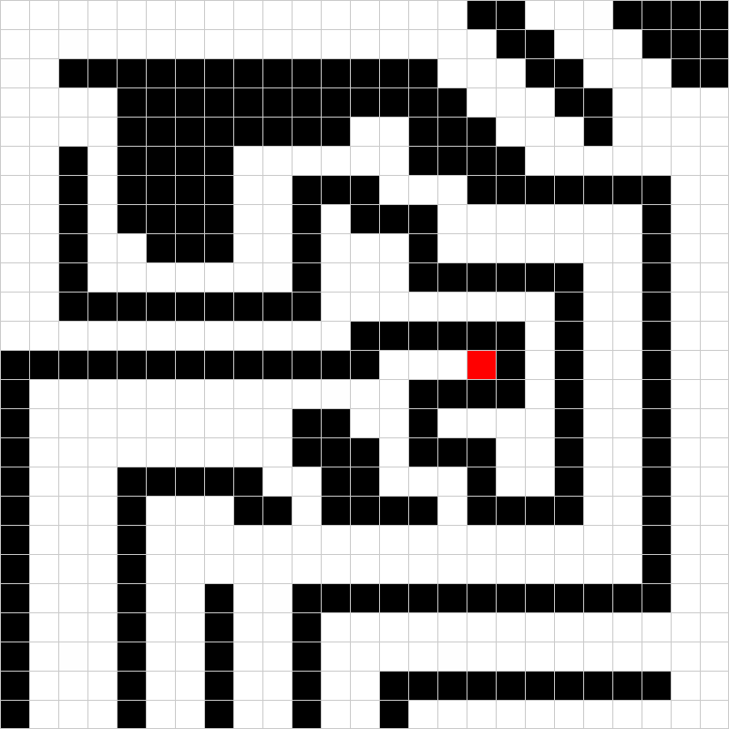

# Practical Course: Intelligent Mobile Robots with ROS (PCIMR)

## Tutorial 01: Linux, Software & ROS

### Introduction

The purpose of this first tutorial is to demonstrate basic knowledge of the operating system Linux (Ubuntu) by using terminal commands, of the versioning system git by submitting your exercises using github and a basic understanding of ROS, as this will be your main task. You can solve this task using either C++ or Python.

After completing this exercise you should be able to
- navigate & modify the file system of Ubuntu in terminal
- understand the package system of ROS, be able to write own packages and nodes
  - Write and debug own subscribers/publishers
  - Know and understand basic ROS communication including message types and tools for debugging/information
- manage your software using git; create forks, commits and upload them to github

If you do not have any prior experience with ROS you may need to go through some of the official [ROS tutorials](http://wiki.ros.org/ROS/Tutorials) first.

### Code Overview


This repository is a ROS meta-package including a package that provides a rudimentary robot simulator for a 2D grid-world. The world used for this exercise is shown below in Fig. 1.


<table style="margin-left: auto; margin-right: auto; table-layout: fixed; width: 100%">
  <tr>
    <td style="width: 30%;"> </td>
    <td style="width: 30%;">  </td>
    <td style="width: 30%;"> </td>
  </tr>
  <tr>
    <td style="width: 30%;" valign="top"> <b>Fig.1:</b> The grid-world for this exercise, white cells are free space and black ones are occupied.
    </td>
    <td style="width: 30%;" valign="top">  <b>Fig.2:</b> The robots range sensors (red).</td>
    <td style="width: 30%;" valign="top">  <b>Fig.3:</b> The grid-world for this exercise, with the goal marked in red.
    </td>
  </tr>
</table>


You can run the node simple_sim_node by using

    rosrun pcimr_simulation simple_sim_node

After running the node you should be able to view the info about the node in the terminal using common ROS commands. You will see, that the node publishes on two different topics:
- the robot position (```/robot_pos```)
- and the sensor data (```/scan```).

The robot has 4 range sensors (+4 optional ones), see Fig. 2. Each sensor measures the distance in tiles to the next object (black cell) in its respective direction. The node also subscribes to the ```/move``` topic, expecting a String as a move command (cardinal direction: ∈ {𝑆, 𝑊, 𝑁, 𝐸}).


### Exercises

Your task is it to write a simple planner node, that listens to the position and sensor information from the simulator node and publishes periodical move commands to make the robot reach the goal (red cell) shown in Fig. 3. The robot will start in the bottom left (green cell).

1. Fork and clone the provided ROS code into your local catkin-workspace. Build your workspace and make sure it runs as expected.
2. Create your own branch and your own ROS package within the provided repository. Make sure to read the rest of this exercise first in order to define the correct dependencies when creating the package (you can also add them later).
3. Now, that you are ready to code, implement a ROS node with two subscribers, one publisher as well as a service call to the simulator node.
   1. The service call to /init_pos is used to initialize the position of the robot to (2, 0).
   2. The subscribers receive the robots position and sensor data from the simulator node.
   3. The publisher sends a simple String as a ROS message on the topic /move.
   4. Now write a simple logic, that combines this data by selecting a movement (S, W, N, E) at each time step, which will guide the robot to the goal (red), while avoiding obstacles (black) and staying with the world boundaries.

Note: This is not a complex algorithm. Just think of how you would explain the path to another person.
